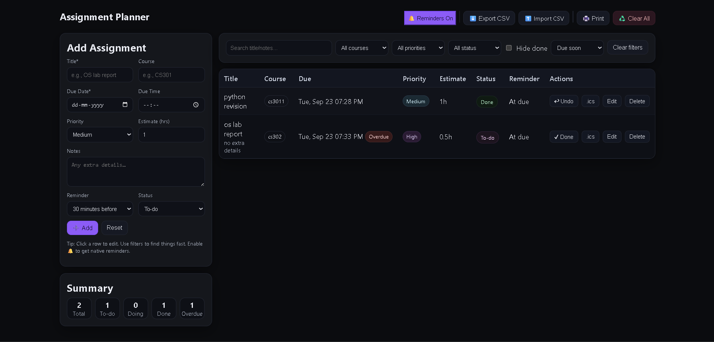

# Assignment Planner



Lightweight, fast, no-backend planner to track assignments by course with due dates, priorities, status, and reminders.

**Live:** https://a2rp.github.io/assignment-planner/  
**Code:** https://github.com/a2rp/assignment-planner

---

## Features

-   Add / edit assignments (Title, Course, Due date & time, Priority, Estimate, Status, Notes)
-   Search, filter (Course / Priority / Status / Hide done) and sort (Due / Priority / Course / Title / Status)
-   CSV **export/import**
-   Per-row **.ics** calendar export
-   **Web Notifications** reminders (fires while the tab is open)
-   Print-ready stylesheet

---

## Clone & Run (Local)

```bash
# 1) Clone
git clone https://github.com/a2rp/assignment-planner.git
cd assignment-planner

# 2) Open directly
#   – Just open index.html in your browser
#      OR run a simple server (recommended):
npx serve .
# or: python -m http.server 5173
```
